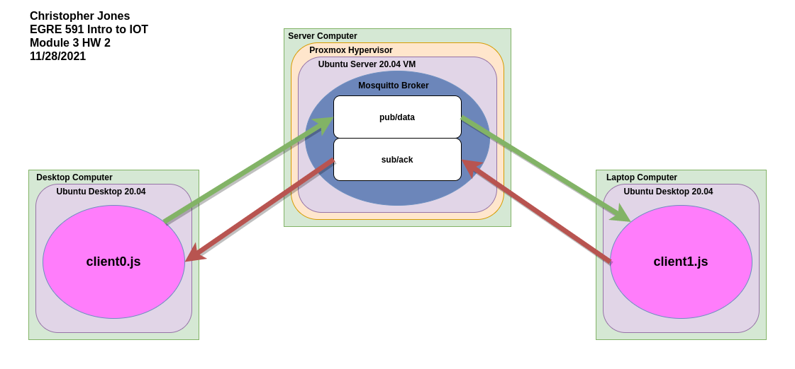

# mqtt_project
### Christopher Jones
#### EGRE 591 Intro to IOT
#### Module 3 HW 2
#### 11/28/2021
## Mosquitto MQTT Broker
Install mosquitto on the device you wish to host the broker:

    snap install mosquitto

Create a password file and add clients:
    
    cd /var/snap/mosquitto/common/
    sudo mosquitto_passwd -c clientcreds client0
    <input password as prompted>
    sudo mosquitto_passwd clientcreds client1
    <input password as prompted>

Copy the example configuration to a new file to be used and begin editing:

    sudo cp mosquitto_example.conf mosquitto.conf
    sudo nano mosquitto.conf

Go to line 232, uncomment, and set the listener to have a static port and IP configuration as shown:

    listener 8883 <host device IP addr>

Go to line 529 and uncomment this line. This disallows anonymous clients from connecting, enforces the password requirement, and allows the listener settings set previously to be used. The line should look like this:

    allow_anonymous false

Finally, go to line 547, uncomment, and enter the path to the password file created previously. In our case the line should look like this:

    password_file /var/snap/mosquitto/common/clientcreds

Save and exit the file.

If mosquitto is already running (it is if it was just installed through snap), restart the broker to apply the changes:

    sudo snap restart mosquitto

If mosquitto is not running, start it:

    sudo snap start mosquitto

The mosquitto broker is now ready!

## Running the clients:

The clients, client0.js and client1.js, and be run on one device or two. In my testing I ran client0 (the publisher) on my desktop computer and client1 (the subscriber) on my laptop.
This configuration is shown below.



Client0 begins counting at 0 once client1 has connected and counts to 100 publishing that number to the pub/data channel. It waits for an acknowledgement message from client1 before incrementing and publishing again.
Client1 sends an acknowledgement message on the sub/ack channel when it begins, letting client0 know that it is ready to receive data.

The clients should be start-order agnostic as if client0 starts first, it just waits until it gets an acknowledge message from client1 to begin. If client1 starts first, the acknowledge message is sent to the broker which holds it until a client subscribes to the sub/ack channel. Thus when client0 connects, it is immediately given the ack message and begins its process.

## client0.js (publisher)
```javascript

const mqtt = require('mqtt')

// Use for loopback if no external broker
// const options= {
//     port: '1883',
//     host: '127.0.0.1'
// }

// External broker
const options={
    port:'8883',
    host:'broker.ip.addr.here',
    username:'client0',
    password:'client0passwd'
}

let inc = 0;

const client = mqtt.connect(options)

client.on('connect', () => {
    client.subscribe('sub/ack');
    console.log("\r\nclient0 connected to broker \r\n ");
})

client.on('message', (topic, message) => {
    if (topic=='sub/ack') {
        console.log( '\n' + message.toString());
        if(inc >= 100){
            client.publish('pub/data', 'done');
            return 0;
        }
        inc++;
        message = inc.toString();
        console.log( '\n' + message.toString());
        client.publish('pub/data', message)
    }
})
```

## client1.js (subscriber)

```javascript
const mqtt = require('mqtt')

// Use for loopback if no external broker
// const options= {
//     port: '1883',
//     host: '127.0.0.1'
// }

// External broker
const options={
    port:'8883',
    host:'broker.ip.addr.here',
    username:'client1',
    password:'client1passwd'
}

const client = mqtt.connect(options)

client.on('connect', () => {
    client.subscribe('pub/data');
    console.log("\r\nclient1 connected to broker \r\n ");

})


client.on('message', (topic, message) => {

    if (topic=='pub/data') {
        let msg = message.toString()
        console.log('Data received from client0 on topic: pub/data '+ msg);
        if(msg === 'done'){
            return 0;
        }
        client.publish('sub/ack','Ack: Success..!!');
        console.log("Acknowledgement sent to client0 ==> Ack: Success..!! \r\n")

    }
})
client.publish('sub/ack','Ack: Ready');
```